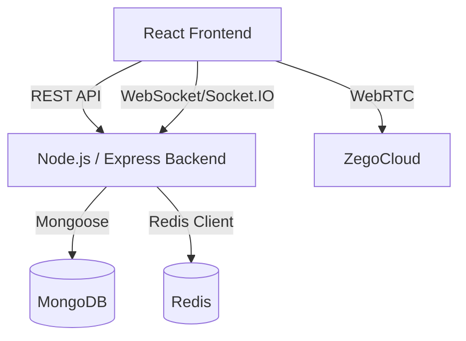

# Echo-er

A real-time chat application built using the MERN stack. It supports instant messaging through WebSockets and traditional operations via REST APIs.

## Architecture

The system consists of a React frontend and a Node.js backend. The frontend communicates with the backend via REST APIs for standard operations and WebSockets for real-time messaging. MongoDB is used for persistent data storage, while Redis is utilized for caching or message brokering. Video communication is handled via ZegoCloud integrations.



### Components

- **Frontend**: React, Vite, TailwindCSS, Recoil, Socket.IO Client.
- **Backend**: Node.js, Express, Socket.IO, Zod, JWT.
- **Database**: MongoDB with Mongoose.
- **External Services**: Redis, ZegoCloud, Nodemailer.

## Local Project Setup

### Prerequisites

- Node.js
- MongoDB
- Redis

### Backend Setup

1. Navigate to the backend directory.
   ```bash
   cd backend
   ```
2. Install dependencies.
   ```bash
   npm install
   ```
3. Configure environment variables. Create a `.env` file based on the required keys.
   ```env
   PORT=3001
   MONGOOSE_URL=<your-mongodb-url>
   JWT_SECRET=<your-jwt-secret>
   FRONTEND_ORIGIN=http://localhost:5173
   SMPT_HOST=smtp.gmail.com
   SMPT_PORT=587
   SMPT_MAIL=<your-email>
   SMPT_APP_PASS=<your-app-password>
   ```
4. Start the backend server.
   ```bash
   node src/index.js
   ```

### Frontend Setup

1. Navigate to the frontend directory.
   ```bash
   cd frontend
   ```
2. Install dependencies.
   ```bash
   npm install
   ```
3. Configure environment variables. Create a `.env` file based on the required keys.
   ```env
   VITE_GET_ROOM_URL=http://127.0.0.1:3001/room/getRooms
   VITE_SEARCH_USER_URL=http://127.0.0.1:3001/search/findUser
   VITE_ADD_USER_URL=http://127.0.0.1:3001/search/addUserToRoom
   VITE_SOCKET_URL=http://localhost:3001
   VITE_RECEIVE_MESSAGE_URL=http://127.0.0.1:3001/chat/receive
   VITE_UPDATE_MESSAGE_URL=http://127.0.0.1:3001/chat/update
   VITE_VERIFY_OTP_URL=http://127.0.0.1:3001/otp/verifyotp
   VITE_SIGNIN_URL=http://127.0.0.1:3001/signin
   VITE_SIGNUP_URL=http://127.0.0.1:3001/signup
   VITE_SEND_OTP_URL=http://127.0.0.1:3001/otp/sendotp
   ```
4. Start the development server.
   ```bash
   npm run dev
   ```
